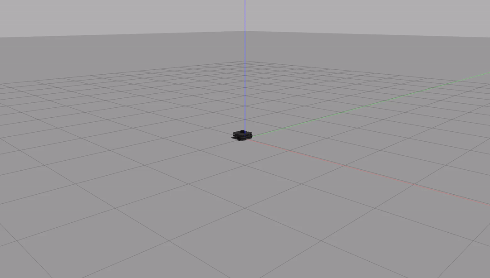

# warmup_project

## Robot Behavior

__*Driving in a Square*__

__High Level Description__
For this project, I took the simpler time based approach, to do this I combined simple instructions of traveling forward for a set amount of time with a turn command, which would then be repeated 4 times to create the four sides of the square.

__Code Explanation__
*SquareRobot Class*
    This is the class made for the assignment
*Turn Function*
    This function performs the action of turning. Modifies Twist message that is passed in to give a angular z speed, combined with a sleep to allow the robot to turn. Following this the z speed is set back to 0, with an additional sleep to ensure proper stopping.
*Straight Line Function*
    This function allows the robot to travel in a straight line to create one side of the square. It sets the value of a passed in Twist message's linear x speed, and sleeps for 5 seconds to allow it to travel. Following this speed is set to 0 again, with an additional sleep to ensure proper stopping.
*MakeSquare Function*
    This function creates the Twist message, gives a sleep command to allow connection to the publisher, and then uses a for loop to create the square with the help of the two previously described functions.

