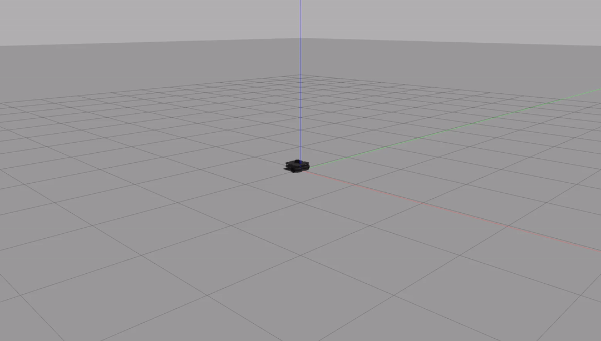
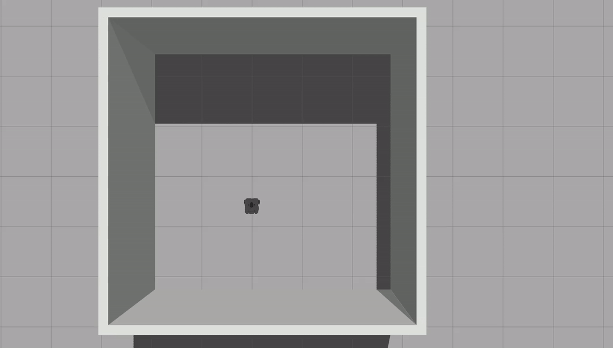

# warmup_project

## Robot Behavior

__*Driving in a Square*__

__High Level Description__
For this project, I took the simpler time based approach, to do this I combined simple instructions of traveling forward for a set amount of time with a turn command, which would then be repeated 4 times to create the four sides of the square.

__Code Explanation__
 *SquareRobot Class*
    This is the class made for the assignment 
 *Turn Function*
    This function performs the action of turning. Modifies Twist message that is passed in to give a angular z speed, combined with a sleep to allow the robot to turn. Following this the z speed is set back to 0, with an additional sleep to ensure proper stopping. 
 *Straight Line Function*
    This function allows the robot to travel in a straight line to create one side of the square. It sets the value of a passed in Twist message's linear x speed, and sleeps for 5 seconds to allow it to travel. Following this speed is set to 0 again, with an additional sleep to ensure proper stopping. 
 *MakeSquare Function*
    This function creates the Twist message, gives a sleep command to allow connection to the publisher, and then uses a for loop to create the square with the help of the two previously described functions.

__*Person Follower*__

__High Level Description__
    For this project, I started from the basis established in the in class assignment of making the robot stop at a wall, in that the goal was to approach an item user the LaserScan. This included additional work to constantly update, as well as to make sure to properly face the object.

__Code Explanation__
 *PersonFollower Class*
    This is the main class made for the assignment. Has an initializer, as well as a follow function, which acts as the callback for the /Scan subscriber. Then has a basic run function which spins. 
 *Follow Function*
    The main body of the class, this function iterates over the range data to identify what angle is closest to the object. It then proceeds to use this to determine the angular velocity, which is calculated such that it decreases the closer the angle is to 0, meaning it turns less when it is more or less facing the object. The linear velocity has a slightly more complicated formula, in which the speed is determined partially by the distance from the object, such that it slows as it approaches it, stopping at 0.5 meters away. In addition, the velocity is modified by the current angle that is closest to the object. This means that the robot goes slower if the object is behind it, and will go faster as it turns toward the object. This is done to properly allow it to face the object while approaching it. Lastly, if no object is seen, the robot stops. 
 *Run Function*
    This is a simple function which spins to listen to the subsribed /scan topic.  
    

__*Wall Follower*__

__High Level Description__
    For this assignment, I approached the task in a few discrete steps which could then be combined. The first problem was approaching and stopping a fixed distance from the wall, similar to the in class assignment. Next was turning to face the wall at a 90 degree angle, then moving along the wall while maintaing distance, and lastly handling turns.
    
__Code Explanation__
 *WallFollower Class*
    The class designed for this function. Overall similar structure to the Person Follower Class, the main difference being in the implementation of the follow function. 
 *Follow Function*
    This function, similar to before, iterates to identify the angle that is closest to the wall, and the distance to the wall. My first case handles the case that we are infinitely away from a wall, in which case the robot moves forward in an attempt to find a wall. The next two cases handle the case that we are two close or far away from the wall, with the ideal distance being 0.5 meters. An area of leniency is given, from 0.4-0.6, so as to prevent constant noise correction. These two cases work by getting the robot to first reposition itself such that the front is facing towards the path that is to be followed, being facing towards the wall if it is too far away from the wall, and facing away from the wall in the other case. Then, when it is facing the wall within a reasonable level, it starts to approach the ideal path, with some angle correction on the way. 
&nbsp;&nbsp;&nbsp;&nbsp;&nbsp;&nbsp;&nbsp;&nbsp;The final case handles the robot once the path has been found, such that the robot is approximately 0.5 meters away from the wall. If the robot is not at a 90 degree angle from the wall it rotates to do this. Once it is properly angled, it starts to go forward, with some angle correction along the way. 
 *Run Function*
Similar to the Person Follower, this simply spins.

  
  
  
__*Challenges*__
    A big challenge was figuring out how to think spatially, which is not something I have had to do often in my programming classes. As such things like working on a whiteboard and drawing out the problem and different situations was potentially helpful. I did not start doing this as soon as I should have, but once I started it was very helpful towards improving my code.

__*Future Work*__
    One major piece of future work I would do would be utilizing the odometer data that is available. The most obvious implementation of this is for the first square function, as it could be used to more accurately perform this relative to simple time-based movement. But further work to potentially find uses in the other two assignments could be interesting. More generally my big goal with future work would be improving efficiency/smoothness. A big problem I found in really all three assignments was that my code struggled from not running very smoothly, which was most noticeable in the third assignment, where I potentially may have been overcorrecting errors which led to the robot spending some time swinging back and forth while not progressing at all.

__*Takeaways*__
* Do a lot more planning ahead of time before starting to code. A big problem I had was that I would come up with what I thought was the right approach, and start coding it first, and try to code the entire process before testing. This led to lots of small mistakes like flipping signs or numbers due to not planning ahead of time. In addition debugging was made more confusing, as it was difficult to establish which parts contained the bug, as I had initially implemented almost all the separate parts.
* Separation of parts. As a continuation of the end of the previous bullet point, split the code up into more discrete elements. I did largely do this for the first part, but for the two follower programs I did not really do this, and it made testing and implementation much more difficult.
